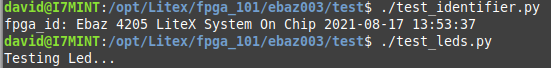
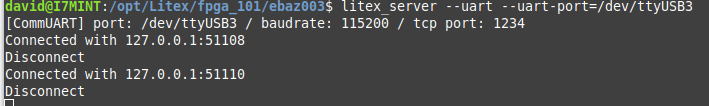

# ebaz 4205 Litex server example

 * build the project  $./base.py script
 * load onto the ebaz $./load.py script
 * start the Litex server $litex_server --uart --uart-port=/dev/ttyUSBX
 * in a seperate console run tests from the test diretory $./test_identifier.py or $./test_leds.py

